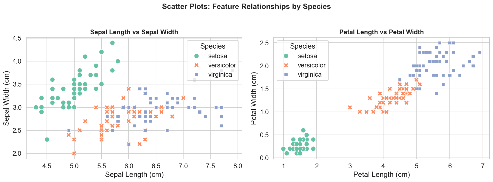
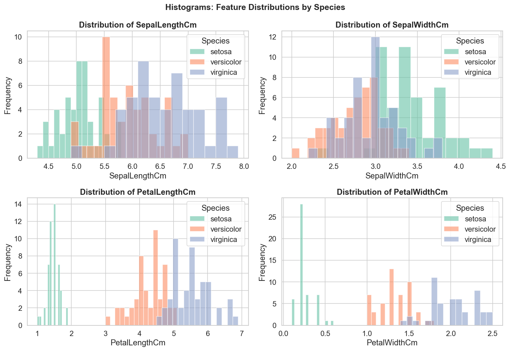
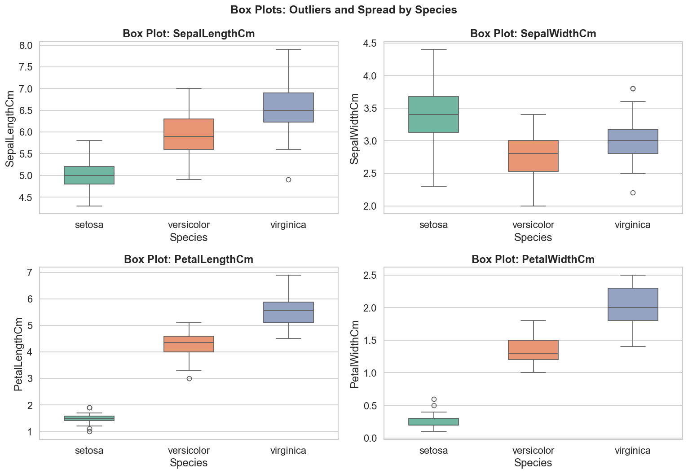
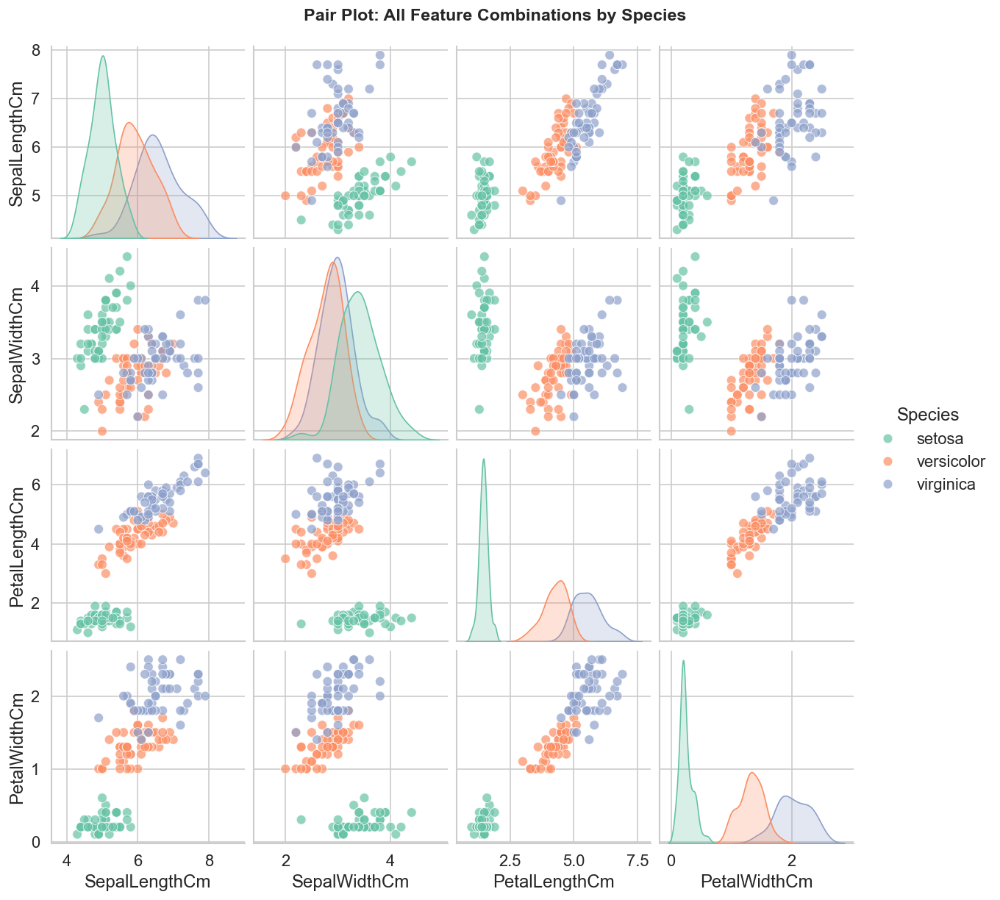
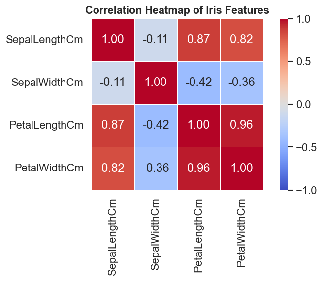

# Data-Science-Internship-Task1-Iris
EDA, ML models, and visualizations of the Iris dataset.
Internship assignments covering data exploration, visualization, model building, and performance evaluation using Python.

---

## 📁 Repository Structure

```
Data-Science-Internship-Task1-Iris/
│
├── Task1_Iris_EDA/
│   ├── Task1_ExploringandVisualizingIris     # Main Jupyter Notebook
│   ├── Iris.csv                 # Dataset
│   └── images/
│       ├── scatter_plots.png
│       ├── histograms.png
│       ├── boxplots.png
│       ├── pairplot.png
│       └── heatmap.png
│
└── README.md
```

---

## Task 1: Exploring and Visualizing the Iris Dataset

### 🎯 Objective

Understand how to read, summarize, and visualize a real-world dataset using Python. The goal is to develop core data exploration skills, including data loading, cleaning, summarization, and the creation of meaningful visualizations to uncover patterns in the data.

---

### 📊 Dataset

| Property | Detail |
|---|---|
| **Name** | Iris Dataset |
| **Format** | CSV |
| **Samples** | 150 rows |
| **Features** | 5 columns (4 numeric + 1 categorical) |
| **Target** | Species (Iris-setosa, Iris-versicolor, Iris-virginica) |
| **Missing Values** | None |
| **Class Balance** | Perfectly balanced 50 samples per species |

**Feature Description:**

| Column | Description | Unit |
|---|---|---|
| SepalLengthCm | Length of the sepal | cm |
| SepalWidthCm | Width of the sepal | cm |
| PetalLengthCm | Length of the petal | cm |
| PetalWidthCm | Width of the petal | cm |
| Species | Iris flower species | — |

---

### 🔍 Approach

**1. Data Loading & Inspection**
- Loaded dataset using `pandas.read_csv()`
- Inspected structure using `.shape`, `.columns`, `.head()`, `.info()`, `.describe()`
- Checked class distribution using `.value_counts()`

**2. Data Cleaning & Preparation**
- Checked for missing values: none found
- Checked for duplicate rows: none found
- Dropped the `Id` column (irrelevant index column)
- Cleaned species labels by removing `Iris-` prefix

**3. Exploratory Data Analysis (EDA)**
- Created 5 visualizations to understand feature distributions and relationships
- Used `matplotlib` and `seaborn` for all plots

---

### 📈 Exploratory Data Analysis (EDA)

| Visualization | Purpose |
|---|---|
| **Scatter Plot** | Analyze relationships between sepal and petal features by species |
| **Histogram** | Examine distribution of each feature per species |
| **Box Plot** | Detect outliers and spread of values per species |
| **Pair Plot** | View all feature combinations at once |
| **Correlation Heatmap** | Measure strength of relationships between numeric features |

**Scatter Plot Sepal vs Petal Features**



**Histograms Feature Distributions**



**Box Plots Outliers and Spread**



**Pair Plot All Feature Combinations**



**Correlation Heatmap**



---

### 🤖 Model Training

> This task focuses on EDA only. Model training will be covered in the upcoming tasks.

---

### 📉 Model Evaluation

> This task focuses on EDA only. Model evaluation will be covered in the upcoming tasks.

---

### ✅ Results & Key Insights

| # | Insight | Detail |
|---|---|---|
| 1 | **Dataset is clean** | No missing values or duplicate rows found |
| 2 | **Best separating features** | `PetalLengthCm` and `PetalWidthCm` clearly separate all three species |
| 3 | **Weakest separator** | `SepalWidthCm` shows heavy overlap between species |
| 4 | **Setosa is easiest** | Iris setosa is completely isolated in petal measurements |
| 5 | **Versicolor & Virginica overlap** | These two species are harder to distinguish using sepal features |
| 6 | **High correlation** | Petal Length and Petal Width are 96% correlated, they carry similar information |
| 7 | **Minor outliers** | A few outliers exist in SepalWidthCm for Iris setosa |
| 8 | **Balanced dataset** | 50 samples per class, ideal for unbiased model training in future tasks |

---

### 🚀 How to Run

**Prerequisites: install required libraries:**

```bash
pip install pandas matplotlib seaborn scikit-learn jupyter
```

**Clone this repository:**

```bash
git clone https://github.com/your-username/Data-Science-Internship-Task1-Iris.git
cd Data-Science-Internship-Task1-Iris
```

**Navigate to Task 1:**

```bash
cd Task1_Iris_EDA
```

**Launch Jupyter Notebook:**

```bash
jupyter notebook
```

**Open** `Task1_ExploringandVisualizingIris` → **Kernel** → **Restart & Run All**

---

### 🛠️ Technologies Used

| Library | Version | Purpose |
|---|---|---|
| Python | 3.x | Programming language |
| pandas | Latest | Data loading, cleaning, summarization |
| matplotlib | Latest | Base plotting and figure customization |
| seaborn | Latest | Statistical visualizations |
| Jupyter Notebook | Latest | Interactive code environment |

---

*Task 1 Complete, EDA skills demonstrated using the Iris dataset.*
